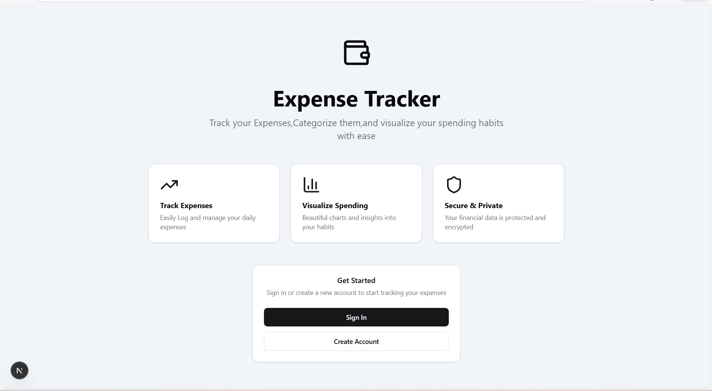
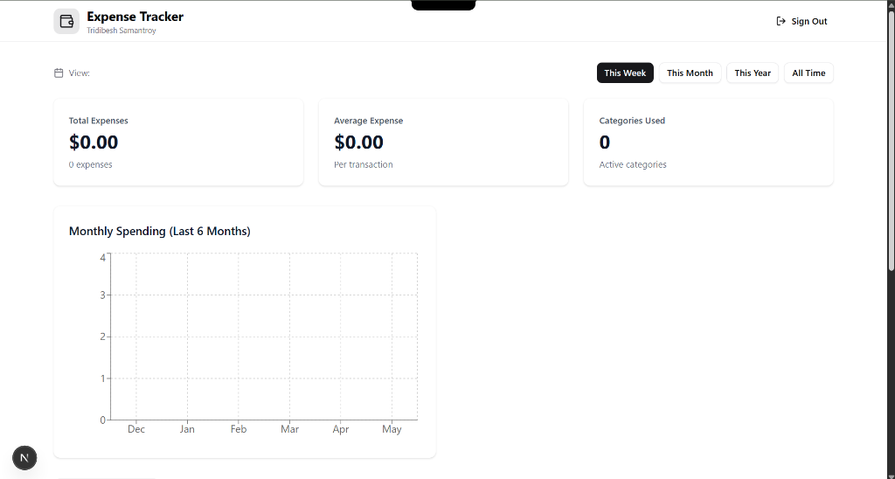
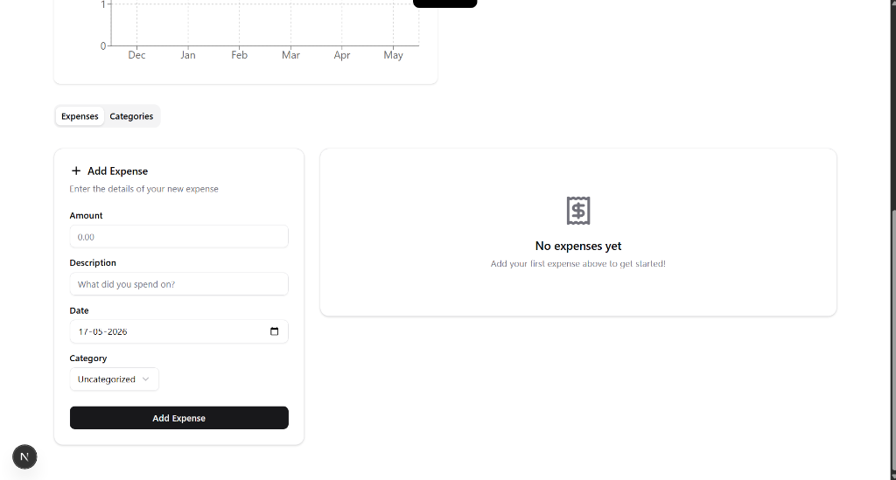
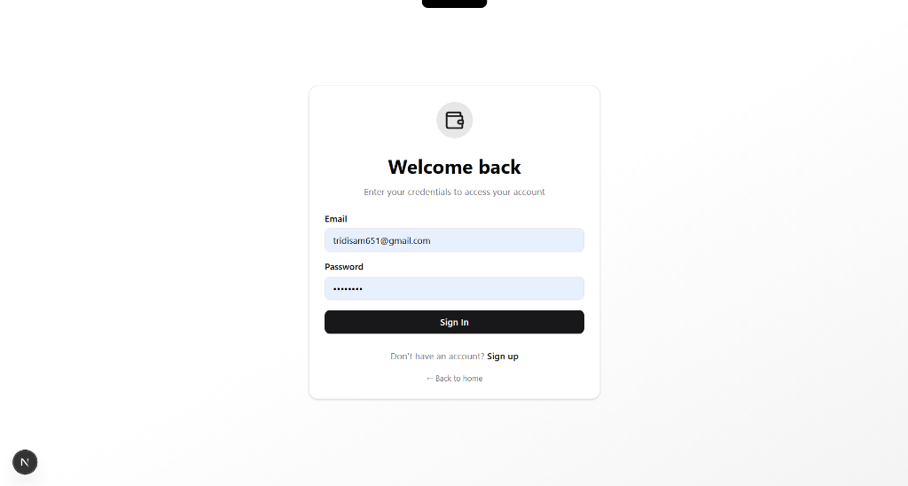
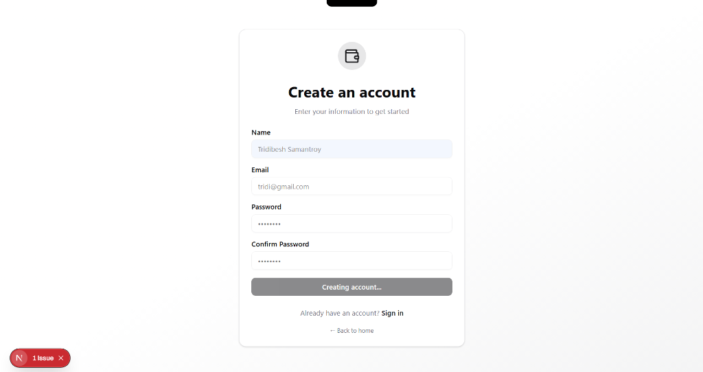
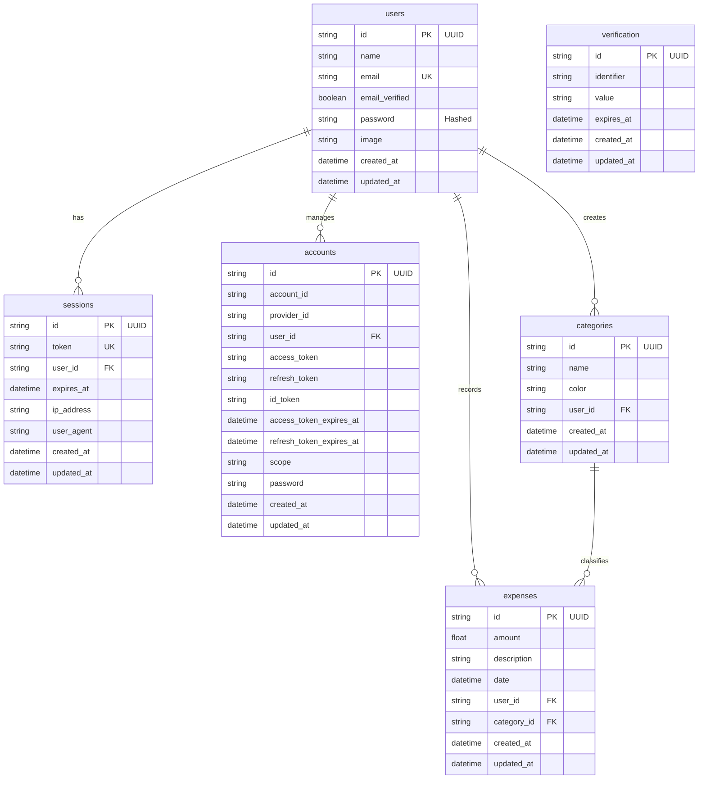

# 💰 Expense Tracker

<div align="center">

[](https://nextjs.org/)
[](https://react.dev/)
[](https://www.typescriptlang.org/)
[](https://www.better-auth.com/)
[](https://www.prisma.io/)
[](https://tailwindcss.com/)
[](https://tanstack.com/query/latest)

A premium, modern, and highly performant expense tracking application. Easily record expenses, manage customized categories, and gain instant clarity on your financial habits with rich interactive charts.

[Features](#-key-features) • [Screenshots](#-visual-walkthrough-screenshots) • [Tech Stack](#-technical-architecture) • [Setup](#-getting-started) • [Database](#-database-schema-architecture)

</div>

---

## ✨ Key Features

- 🔐 **Modern Authentication**: Secure sign-up/sign-in flows powered by **Better Auth** with email & password support, password hashing, and session management.
- 📊 **Interactive Analytics Dashboard**: Gain instant visibility over your spending habits. Features cards for *Total Expenses*, *Average Transaction Value*, and *Active Categories* mapped against a 6-month historical spending trend chart.
- ➕ **Expense Management**: Seamless creation, update, and deletion of expenses with amounts, detailed descriptions, custom dates, and category tags.
- 🎨 **Dynamic Categorization**: Group your expenses with customized categories, complete with color-coded labels and visual tags.
- 📈 **Stunning Visualizations**: Modern chart rendering powered by **Recharts** for visualizing monthly cash flow changes.
- 🚀 **Next.js 15 App Router**: Leverages React Server Components (RSC), server actions, client-side hydration, and dynamic routing for a blazing-fast user experience.
- 📱 **Premium UI/UX**: Fully responsive and premium glassmorphic interface built with **Tailwind CSS v4** and headless **Radix UI** primitives.
- 🛠️ **Full Type Safety**: End-to-end type safety spanning the database to the browser with **TypeScript** and **Zod** schema validations.

---

## 📸 Visual Walkthrough (Screenshots)

### 🏠 Landing Page
A polished, welcoming entrance showcasing the value proposition and core features of the Expense Tracker.


### 📊 Analytics Dashboard
Get immediate insights into your spending habits. Review total costs, average spending per transaction, and active category usage alongside an interactive 6-month historical timeline.


### ➕ Expense & Category Management
Easily log transactions, categorize your expenses, and select custom dates with real-time UI updates.


### 🔐 Secure Authentication Experience
Clean, beautiful, and secure login and registration cards powered by Better Auth.

<div align="center">
  <table border="0" cellspacing="10" cellpadding="0">
    <tr>
      <td width="48%" align="center" valign="top">
        <b>🔑 Welcome Back (Sign In)</b><br/><br/>
        
      </td>
      <td width="4%" align="center"></td>
      <td width="48%" align="center" valign="top">
        <b>📝 Create an Account (Sign Up)</b><br/><br/>
        
      </td>
    </tr>
  </table>
</div>

---

## 🛠️ Technical Architecture

| Layer | Technology | Purpose |
| :--- | :--- | :--- |
| **Frontend Framework** | **Next.js 15.5.6 (App Router)** | UI Engine, Server Components & Dynamic Routing |
| **State Management** | **TanStack React Query v5** | Server state caching, background synchronization, and optimistic UI updates |
| **Authentication** | **Better Auth v1.4.4** | Multi-session support, email/password registration, secure JWTs, and session storage |
| **Database ORM** | **Prisma v5.22.0** | Type-safe database client and automated migration management |
| **Database** | **PostgreSQL (Neon Cloud)** | Relational database hosting for reliable and ACID-compliant storage |
| **Styling** | **Tailwind CSS v4** | Rapid, optimized, and unified CSS generation with design tokens |
| **Data Validation** | **Zod** | Schema-driven runtime validation for API payloads and forms |
| **UI Components** | **Radix UI Primitives & Sonner** | Unstyled, accessible component primitives and sleek toast notifications |
| **Charts** | **Recharts** | Interactive, composable SVGs for responsive financial rendering |

---

## 🗃️ Database Schema Architecture

The relational database is structured with a normalized layout to guarantee data consistency. Cascade deletions are set up to automatically clean up sessions, categories, and expenses when a user account is deleted.



---

## 📂 Project Directory Structure

```text
├── app/                  # Next.js App Router (Pages, Layouts, API routes)
│   ├── api/
│   │   ├── auth/[...all]/# Better Auth handler endpoints
│   │   └── expenses/     # Expense-related CRUD REST endpoints
│   ├── dashboard/        # Main interactive dashboard layout and pages
│   ├── layout.tsx        # Global page HTML framework
│   ├── page.tsx          # Marketing Landing page
│   └── providers.tsx     # Theme, QueryClient, and Toast Provider wrappers
├── components/           # React component suite
│   ├── ui/               # Radix UI and highly styling-flexible components
│   └── ...               # Custom layout components (Dashboard widgets, Forms)
├── lib/                  # Utilities, Auth client definitions, and Prisma client helpers
│   ├── auth.ts           # Better Auth configurations
│   ├── prisma.ts         # Singleton database client instance
│   └── utils.ts          # Tailwind and class merging helper functions
├── prisma/               # Schema design and database migrations
│   └── schema.prisma     # Relational PostgreSQL mapping rules
├── public/               # Public static assets (Icons, SVGs)
└── ScreenShots/          # Readme visual resources
```

---

## 🚀 Getting Started

### Prerequisites
- **Node.js**: `v18.x` or later
- **PostgreSQL**: A running local server, dockerized instance, or Neon/Supabase cloud cluster
- **Package Manager**: `npm`

### Installation & Setup

1. **Clone the Repository & Navigate**:
   ```bash
   git clone <repository-url>
   cd ExpenseTracker
   ```

2. **Install Dependencies**:
   ```bash
   npm install
   ```

3. **Configure Environment Variables**:
   Create a `.env` file in the root `expensetracker` directory:
   ```env
   # Database connection string (PostgreSQL)
   DATABASE_URL="postgresql://<username>:<password>@<host>:<port>/<dbname>?sslmode=require"

   # Better Auth Setup
   NEXT_PUBLIC_BETTER_AUTH_URL="http://localhost:3000"
   # Generate a 32-character secret using: openssl rand -base64 32
   BETTER_AUTH_SECRET="your-generated-base64-secret"
   ```

4. **Sync Prisma Database Schema**:
   Generate the type-safe client and push the schema directly to your PostgreSQL database:
   ```bash
   # Generate Prisma Client
   npx prisma generate

   # Sync structural schema with the active database
   npx prisma db push
   ```

5. **Start the Development Server**:
   ```bash
   npm run dev
   ```
   Open your browser and navigate to [http://localhost:3000](http://localhost:3000) to view the application!

---

## 📜 CLI Scripts Reference

The following commands are configured in the `package.json` for rapid workflow execution:

| Command | Action |
| :--- | :--- |
| `npm run dev` | Spins up the local development server at [localhost:3000](http://localhost:3000) |
| `npm run build` | Compiles and optimizes the React application for production |
| `npm run start` | Boots up the production server after compilation |
| `npm run lint` | Runs ESLint utility checks to analyze code formatting and styling |
| `npx prisma generate` | Regenerates local TypeScript declarations based on `schema.prisma` |
| `npx prisma db push` | Pushes local database schema state directly to your remote or local PostgreSQL database |
| `npx prisma studio` | Opens Prisma's interactive GUI visual editor at [localhost:5555](http://localhost:5555) |

---

## 🤝 Contributing

Contributions make the open-source community an amazing place! If you would like to help improve the project:
1. **Fork** the Repository.
2. **Create a Feature Branch** (`git checkout -b feature/AmazingFeature`).
3. **Commit your changes** (`git commit -m 'Add some AmazingFeature'`).
4. **Push the branch** (`git push origin feature/AmazingFeature`).
5. **Open a Pull Request** detailing your enhancements.

---

## 📄 License

Distributed under the MIT License. See `LICENSE` for more information.

---

## ✍️ Author & Credits

Designed, built, and maintained with ❤️ by:

* **Tridibesh Samantroy** - [GitHub Profile](https://github.com/Tridibesh-Samantroy)